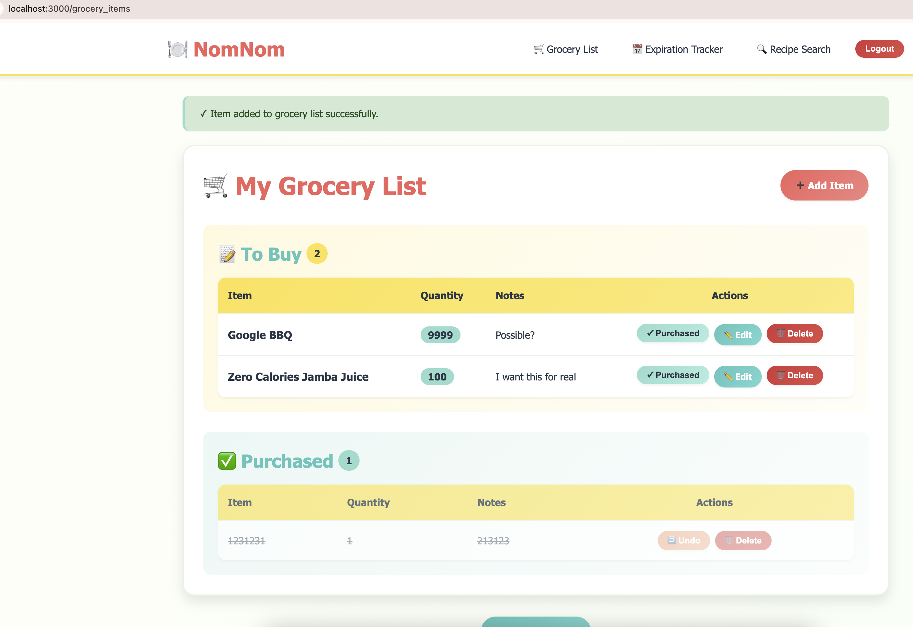
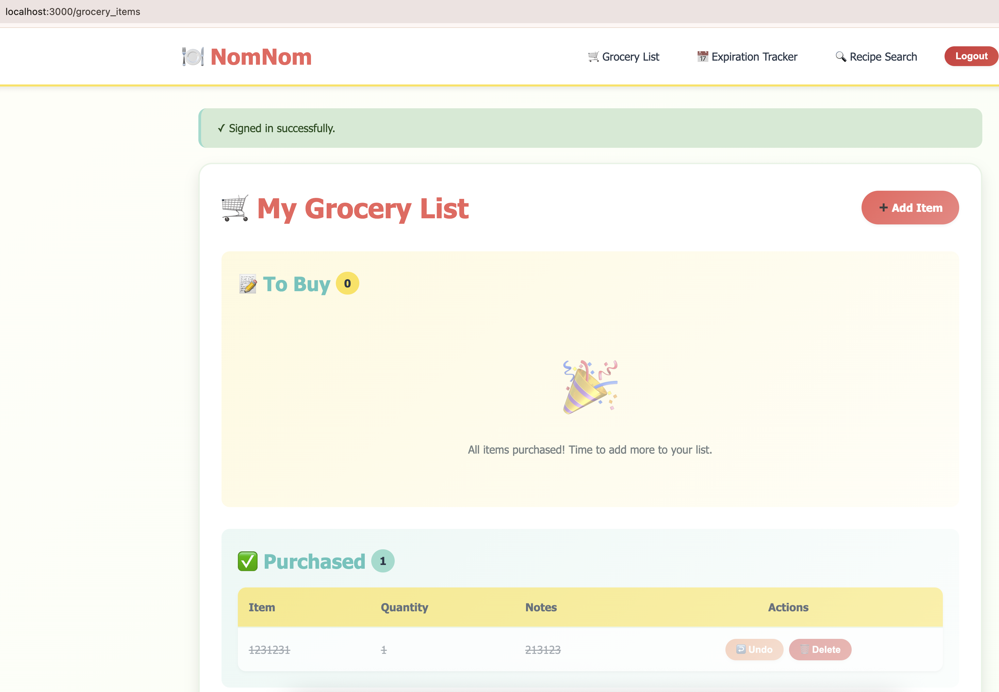
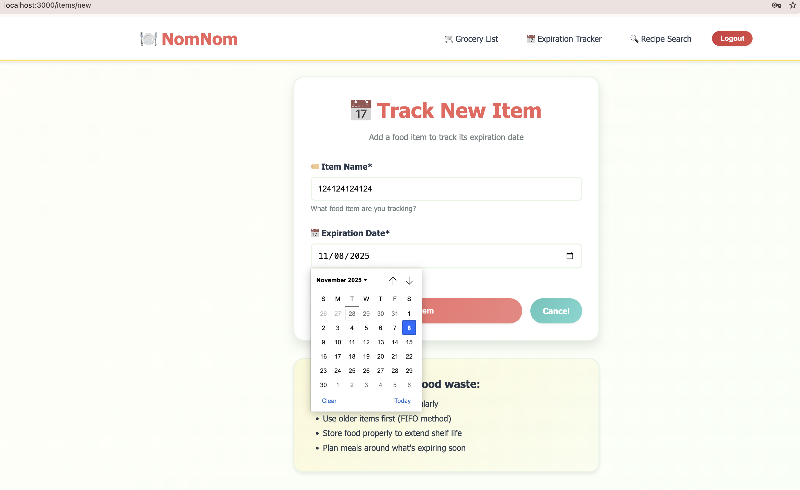

# NomNom - Smart Food Management App

**Eat smart. Waste less. NomNom more.**

A Ruby on Rails web application for managing grocery shopping, tracking food expiration dates, and discovering recipes.

---

## Features

### Grocery List

- Create and manage shopping lists
- Mark items as purchased/unpurchased
- Add quantity and notes for each item
- User-specific lists

### Expiration Date Tracker

- Track food items and their expiration dates
- Color-coded status badges (Fresh/Warning/Urgent/Expired)
- Reduce food waste by monitoring what you have

### Recipe Search

- Discover recipes based on available ingredients
- Find new ways to use what you already have

### Modern UI

- Fruit-themed color palette
- Responsive design (mobile-friendly)
- Gradient buttons and smooth animations
- Intuitive navigation

---

## Screenshots

### Homepage


_Feature cards for quick access to all functionality_

### Grocery List


_Organize your shopping with separate views for items to buy and purchased items_

### Expiration Tracker


_Color-coded status system to track food freshness_

> **Note:** Screenshots coming soon! Run the app locally to see the full UI.

---

## Tech Stack

- **Framework:** Ruby on Rails 8.1.0
- **Ruby Version:** 3.3.8
- **Database:** PostgreSQL
- **Authentication:** Devise
- **Testing:** Cucumber, RSpec
- **Styling:** Custom CSS with modern design system

---

## Prerequisites

- Ruby 3.3.8 (via rbenv)
- PostgreSQL
- Bundler gem

### Install PostgreSQL

**On macOS:**

```bash
brew install postgresql@15
brew services start postgresql@15
```

**On Linux:**

```bash
sudo apt-get install postgresql postgresql-contrib
sudo service postgresql start
```

---

## Setup

### 1. Clone the repository

```bash
git clone https://github.com/D-SehKim/SaaS_Project.git
cd SaaS_Project/NomNom
```

### 2. Install Ruby 3.3.8

```bash
rbenv install 3.3.8
rbenv local 3.3.8
```

### 3. Install dependencies

```bash
gem install bundler
bundle install
```

### 4. Setup database

```bash
rails db:create
rails db:migrate
rails db:seed  # Optional: adds sample data
```

### 5. Run the application

```bash
rails server
```

The app will be available at `http://localhost:3000`

---

## Usage

1. **Sign up** for a new account or **log in**
2. Navigate to:
   - **Grocery List** - Plan your shopping trips
   - **Expiration Tracker** - Monitor food freshness
   - **Recipe Search** - Find recipes using your ingredients

---

## Development

### Running tests

```bash
# Run all tests
bundle exec rspec

# Run Cucumber features
bundle exec cucumber
```

### Code quality

```bash
# Run Rubocop
bundle exec rubocop

# Run Brakeman security scan
bundle exec brakeman
```

---

## Team

### Sprint 1 (Current)

- **Daniel Kim** - Expiration Date Tracker, Recipe Search
- **Minsuk Kim** - Grocery List, UI/UX Design
- **Rebecca Zhao** - Calorie Tracking
- **Eric Chen** - Authentication Testing

---

## Contributing

1. Create a feature branch (`git checkout -b feature/your-feature`)
2. Commit your changes (`git commit -m 'Add some feature'`)
3. Push to the branch (`git push origin feature/your-feature`)
4. Create a Pull Request
5. Request review from team members

---

## License

This project is part of a Columbia University SaaS course assignment.

---

## Acknowledgments

- Built with Ruby on Rails
- UI inspired by modern food management apps
- Color palette designed around fresh fruits and vegetables
